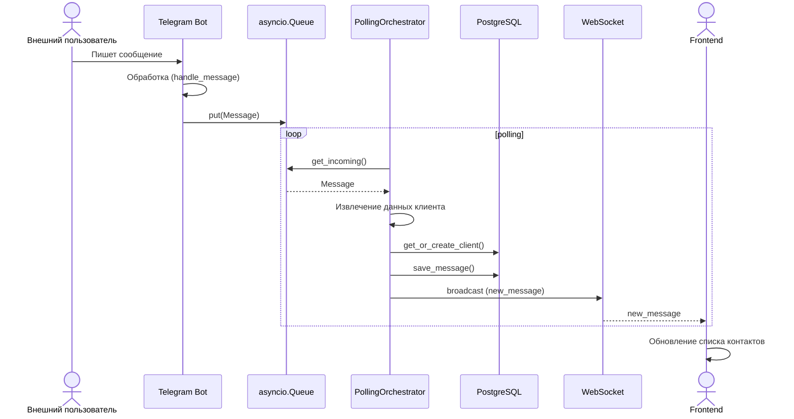
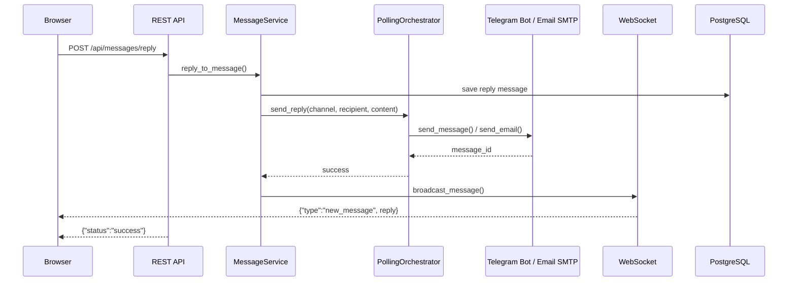
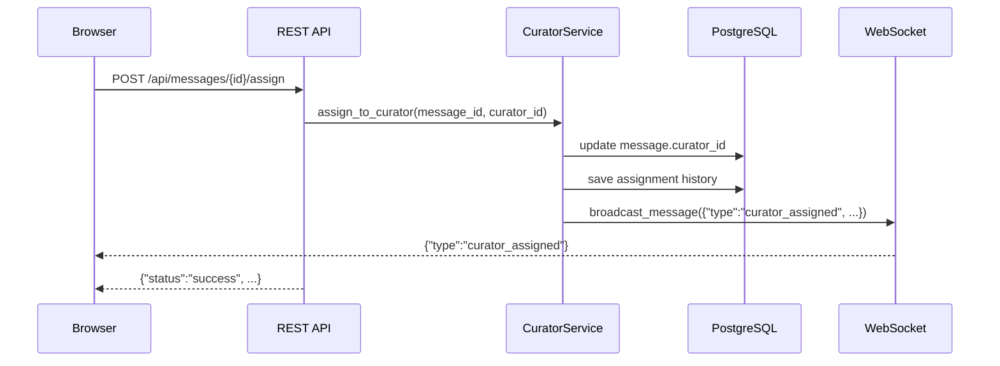
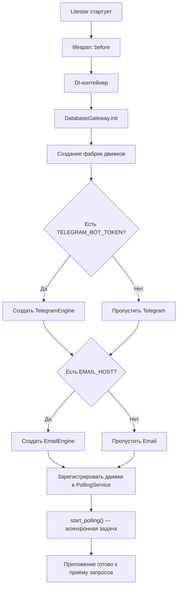

# Omnichannel Messaging Solution

Единое окно для просмотра и ответа на сообщения из Telegram, Email и других каналов.

Система позволяет оператору (куратору) обрабатывать входящие сообщения из всех подключённых каналов в одном интерфейсе, назначать ответственных, передавать диалоги между сотрудниками и вести историю переписки.

**Решаемые задачи:**

- Агрегация сообщений из разных мессенджеров и почты в единый интерфейс
- Автоматическое создание контактов из входящих сообщений
- Назначение и передача диалогов между кураторами
- WebSocket-уведомления о новых сообщениях в реальном времени
- Отправка ответов в исходный канал (Telegram / Email)

**Используемые системы и компоненты:**

| Компонент | Назначение |
|-----------|-----------|
| Python 3.14 / Litestar | REST API + WebSocket + статика |
| React 19 + TypeScript + Vite | Фронтенд |
| PostgreSQL + SQLAlchemy (async) | База данных |
| MinIO (S3-совместимое) | Хранение файлов (фото, документы, стикеры) |
| python-telegram-bot | Движок Telegram |
| IMAP / SMTP | Движок Email |
| JWT + bcrypt | Аутентификация |
| punq | DI-контейнер |

---

## Архитектура

```
┌──────────────┐     HTTP / WebSocket     ┌──────────────────────┐
│   Браузер    │ ──────────────────────── │    Бэкенд (8000)     │
│  (React SPA) │ ◀──────────────────────── │  Litestar + Uvicorn  │
└──────────────┘                           └──────────┬───────────┘
                                                       │
                    ┌──────────────────────────────────┼──────────────────────┐
                    │               REST API           │    WebSocket         │
                    ▼                                  ▼                      ▼
           ┌──────────────┐                  ┌──────────────┐     ┌──────────────────┐
           │  PostgreSQL   │                  │    MinIO     │     │ PollingService   │
           │    (5432)     │                  │  S3 (9000)   │     │ (движки: poll)   │
           └──────────────┘                  └──────────────┘     └────────┬─────────┘
                                                                           │
                                                 ┌─────────────────────────┼──────────────┐
                                                 ▼                         ▼              ▼
                                          ┌──────────────┐        ┌──────────────┐  ┌──────────┐
                                          │   Telegram   │        │   IMAP /     │  │ Slack /  │
                                          │     Bot      │        │    SMTP      │  │ Discord  │
                                          └──────────────┘        └──────────────┘  │ (future) │
                                                                                     └──────────┘
```

### Clean Architecture (слои)

```
App (конфиг, DI-контейнер, точка входа)
  └─ API (роуты, схемы, зависимости)
       └─ Core (доменные модели, сервисы, порты/интерфейсы)
            └─ Adapters (движки, gateway, репозитории, внешние системы)
```

### Структура проекта

```
├── app/
│   ├── main.py              # Точка входа бэкенда (lifespan, роуты, CORS)
│   ├── config.py            # Конфигурация из .env
│   ├── container.py         # DI-контейнер (punq)
│   ├── events.py            # WebSocket-уведомления (broadcast)
│   ├── api/
│   │   ├── routers/         # REST-эндпоинты
│   │   │   ├── routes.py       # /messages, /channels, /upload
│   │   │   ├── client_routes.py  # /clients
│   │   │   ├── curator_routes.py # /curators
│   │   │   ├── auth_routes.py    # /auth
│   │   │   └── health.py        # /health
│   │   ├── schemas/         # DTO (message, client, curator)
│   │   └── dependencies/    # DI-провайдеры
│   └── core/
│       ├── domain/models/   # Message, ChannelType, и т.д.
│       ├── services/        # MessageService, PollingOrchestrator
│       ├── ports/           # Абстрактные интерфейсы
│       └── errors/          # Кастомные исключения
├── frontend/
│   ├── src/
│   │   ├── App.tsx          # Главный компонент
│   │   ├── api.ts           # API-клиент (WS + HTTP)
│   │   ├── types.ts         # TypeScript-типы
│   │   └── components/      # React-компоненты
│   └── package.json
├── Dockerfile               # Многостадийная сборка (frontend → backend)
├── docker-compose.yml       # postgres + minio + app
└── .env.example             # Шаблон настроек
```

---

## Диаграммы процессов

### Процесс получения и обработки входящего сообщения



### Процесс отправки ответа куратором



### Процесс назначения куратора на сообщение



### Процесс запуска приложения (lifespan)



---

## Быстрый старт (Docker Compose)

**Требования:** Docker / Podman, Docker Compose / Podman Compose, git, минимум 2 ГБ ОЗУ.

```bash
git clone <репозиторий> omnichannel
cd omnichannel

# Скопировать настройки
cp .env.example .env
```

Отредактируйте `.env` — минимум нужно указать:

- `TELEGRAM_BOT_TOKEN` — токен бота (как получить — ниже)
- `EMAIL_PASSWORD` — пароль приложения для почты (как получить — ниже)
- `JWT_SECRET` — любой сложный пароль (или оставьте `change-me`)

Запустить:

```bash
docker compose up --build
```

Всё соберётся и запустится. Откройте **http://localhost:8000** в браузере.

**Что поднимается:**

| Сервис | Порт | Описание |
|--------|------|----------|
| Приложение | `8000` | Фронтенд + API |
| PostgreSQL | `5432` | База данных |
| MinIO | `9000` / `9001` | S3-хранилище (файлы) |

При первом запуске миграции БД накатываются автоматически (SQLAlchemy create_all).

### Особенности запуска

- Если используется VPN на хосте — примените `network_mode: "host"` в `docker-compose.yml` для сервиса `app`, чтобы контейнер использовал сеть хоста (включая VPN)
- Если Telegram недоступен (блокировка), движок Telegram пропускается, Email продолжает работать
- При ошибке подключения к Telegram — приложение не падает, Email и другие движки запускаются независимо

---

## Детальный запуск (без Docker)

### 1. База данных

```bash
# Установите PostgreSQL, затем:
createdb omnichannel
```

### 2. Бэкенд

```bash
# Установите Python 3.14+ и Poetry
poetry install
cp .env.example .env
# Отредактируйте .env под себя

# Применить миграции
poetry run alembic upgrade head

# Запустить сервер
poetry run uvicorn app.main:app --host 0.0.0.0 --port 8000 --reload
```

### 3. Фронтенд

```bash
cd frontend
npm install
npm run build    # сборка для продакшена
# или
npm run dev      # режим разработки (порт 5173 с прокси на 8000)
```

В продакшене фронтенд раздаётся самим бэкендом на порту `8000`. В режиме `dev` используйте Vite на порту `5173` — он будет проксировать API-запросы на бэкенд.

---

## Функции системы

### Для кого

Система предназначена для **кураторов (операторов)** — сотрудников, которые обрабатывают входящие сообщения от клиентов.

### Регистрация и вход

1. Откройте **http://localhost:8000**
2. Нажмите «Зарегистрироваться»
3. Укажите ФИО, логин, email, пароль
4. После регистрации — автоматический вход
5. При повторном визите — войдите по логину и паролю

### Основные возможности

| Функция | Как использовать |
|---------|-----------------|
| **Просмотр контактов** | На левой панели отображаются все контакты, сгруппированные по каналу (Telegram / Email). Контакты создаются автоматически из входящих сообщений |
| **Фильтрация по каналу** | Кнопки «Все», «Telegram», «Email» — показывают только контакты из выбранного канала |
| **Просмотр сообщений** | Выберите контакт → справа откроется история переписки |
| **Ответить** | Введите текст в поле ввода (или прикрепите файл через кнопку) и отправьте. Ответ уходит в Telegram / Email получателю |
| **Назначение куратора** | Откройте карточку клиента (кнопка ℹ️) → выберите куратора из списка |
| **Передача диалога** | В карточке клиента можно передать диалог другому куратору |
| **Просмотр активных назначений** | В боковом меню → раздел «Мои назначения» |

### Обработка файлов

Система автоматически обрабатывает и сохраняет в S3:
- **Telegram**: фотографии, стикеры (webp/webm/tgs), GIF, документы, видео
- **Email**: вложения (через Base64 → S3)

---

## API endpoints

### Публичные

| Метод | Путь | Описание |
|-------|------|----------|
| GET | `/health` | Проверка здоровья сервиса |
| POST | `/api/auth/register` | Регистрация куратора |
| POST | `/api/auth/login` | Вход по логину/паролю |
| GET | `/api/auth/me` | Текущий пользователь (требует токен) |

### Защищённые (требуют `Authorization: Bearer <token>`)

| Метод | Путь | Описание |
|-------|------|----------|
| GET | `/api/clients` | Список всех клиентов |
| GET | `/api/clients/{id}` | Клиент по ID |
| PUT | `/api/clients/{id}` | Обновить клиента |
| GET | `/api/clients/by-channel` | Найти клиента по каналу |
| GET | `/api/messages` | Список сообщений (фильтры: `channel`, `sender_id`, `curator_id`, `limit`, `offset`) |
| GET | `/api/messages/{id}` | Сообщение по ID |
| POST | `/api/messages/reply` | Ответить на сообщение |
| POST | `/api/messages/{id}/assign` | Назначить куратора |
| POST | `/api/messages/{id}/transfer` | Передать другому куратору |
| GET | `/api/messages/{id}/assignments` | История назначений сообщения |
| GET | `/api/curators` | Список кураторов |
| POST | `/api/curators` | Создать куратора |
| GET | `/api/curators/{id}` | Куратор по ID |
| PUT | `/api/curators/{id}` | Обновить куратора |
| PATCH | `/api/curators/{id}/status` | Сменить статус (active/inactive) |
| DELETE | `/api/curators/{id}` | Удалить куратора |
| GET | `/api/curators/{id}/assignments` | История назначений куратора |
| GET | `/api/channels` | Список поддерживаемых каналов |
| POST | `/api/upload` | Загрузить файл в S3 |

### WebSocket

| Путь | Протокол | Описание |
|------|----------|----------|
| `/ws` | JSON (text frames) | Сервер шлёт события `new_message`, `curator_assigned`, `curator_transferred` |

---

## Настройка каналов

### Telegram

1. Найдите в Telegram бота [@BotFather](https://t.me/BotFather)
2. Отправьте команду `/newbot`
3. Введите **имя** бота (отображаемое, любое)
4. Введите **username** бота (должен заканчиваться на `bot`, например `MySupportBot`)
5. BotFather выдаст токен — скопируйте его
6. Вставьте токен в `.env`:

```
TELEGRAM_BOT_TOKEN=1234567890:ABCdefGHIjklmNOPqrstUVwxyz
```

7. Для корректной работы через Docker с VPN используйте `network_mode: "host"` (см. раздел запуска)

### Email (на примере Yandex)

1. Зайдите в почтовый ящик на yandex.ru
2. Нажмите на значок шестерёнки → **«Все настройки»**
3. Перейдите в раздел **«Почтовые программы»**
4. Поставьте галочку **«С сервера imap.yandex.ru по протоколу IMAP»**
5. Перейдите в раздел **«Безопасность»**
6. В абзаце про пароли приложений нажмите ссылку **«Создайте и включите пароли приложений»**
7. В выпадающем списке выберите **«Почта»** и нажмите «Создать»
8. Яндекс покажет ключ (16 символов) — **скопируйте и сохраните** (он показывается один раз)
9. Укажите ваши данные в `.env`:

```
EMAIL_HOST=imap.yandex.ru
EMAIL_PORT=993
EMAIL_USER=ваш_логин@yandex.ru
EMAIL_PASSWORD=сгенерированный_ключ
EMAIL_POLL_INTERVAL=60
EMAIL_SMTP_HOST=smtp.yandex.ru
EMAIL_SMTP_PORT=465
```

### Slack / Discord / VK

Поддерживаются через архитектуру Abstract Factory — добавьте новый класс движка и зарегистрируйте фабрику в `container.py`.

---

## Переменные окружения

| Переменная | По умолчанию | Описание |
|------------|-------------|----------|
| `DATABASE_USER` | `user` | Пользователь PostgreSQL |
| `DATABASE_PASSWORD` | `password` | Пароль PostgreSQL |
| `DATABASE_HOST` | `localhost` | Хост PostgreSQL |
| `DATABASE_PORT` | `5432` | Порт PostgreSQL |
| `DATABASE_NAME` | `omnichannel` | Имя БД |
| `DATABASE_URL` | — | Полный URL (перекрывает остальные настройки БД) |
| `MINIO_ENDPOINT` | `http://localhost:9000` | Адрес MinIO |
| `MINIO_ACCESS_KEY` | `minioadmin` | Ключ доступа MinIO |
| `MINIO_SECRET_KEY` | `minioadmin` | Секретный ключ MinIO |
| `MINIO_BUCKET` | — | Имя корзины MinIO |
| `TELEGRAM_BOT_TOKEN` | — | Токен Telegram-бота |
| `EMAIL_HOST` | — | IMAP-сервер (например `imap.yandex.ru`) |
| `EMAIL_PORT` | `993` | Порт IMAP |
| `EMAIL_USER` | — | Логин email |
| `EMAIL_PASSWORD` | — | Пароль приложения (не основной!) |
| `EMAIL_SMTP_HOST` | как `EMAIL_HOST` | SMTP-сервер для отправки |
| `EMAIL_SMTP_PORT` | `587` | Порт SMTP |
| `EMAIL_POLL_INTERVAL` | `60` | Интервал проверки почты (сек) |
| `JWT_SECRET` | `change-me` | Секрет для JWT-токенов |
| `JWT_ALGORITHM` | `HS256` | Алгоритм JWT |
| `ACCESS_TOKEN_EXPIRE_MINUTES` | `1440` | Время жизни токена |
| `DEBUG` | `false` | Режим отладки |
| `LOG_LEVEL` | `INFO` | Уровень логов |

---

## Тестирование

```bash
# бэкенд
poetry run pytest

# фронтенд
cd frontend && npm run build   # проверит TypeScript + сборку
```

---

## Возможные проблемы

| Проблема | Решение |
|----------|---------|
| Telegram бот не отвечает (TimedOut) | Проверить доступ к `api.telegram.org` из контейнера. Использовать `network_mode: "host"` если включён VPN |
| Нет контактов в интерфейсе | Убедиться что движки запущены (`podman logs omnichannel-app \| grep engine`). Отправить сообщение боту или на email |
| Файлы не загружаются | Проверить MinIO (`http://localhost:9001`, admin/adminminioadmin). Убедиться что `MINIO_ENDPOINT` корректен |
| 401 при запросах к API | Залогиниться заново; проверить что JWT_SECRET совпадает |
