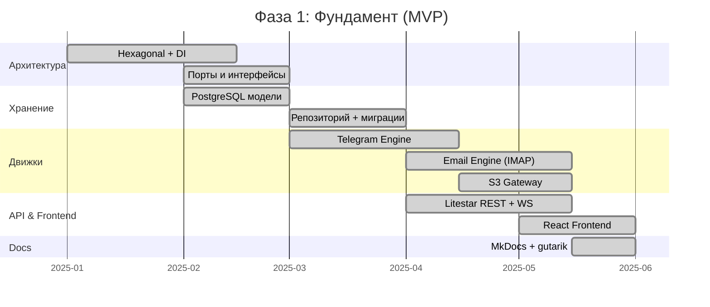
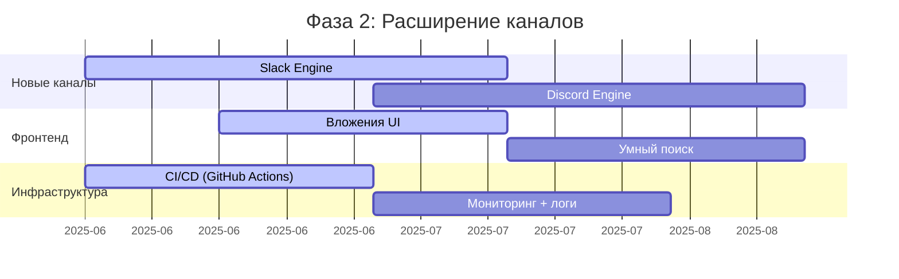
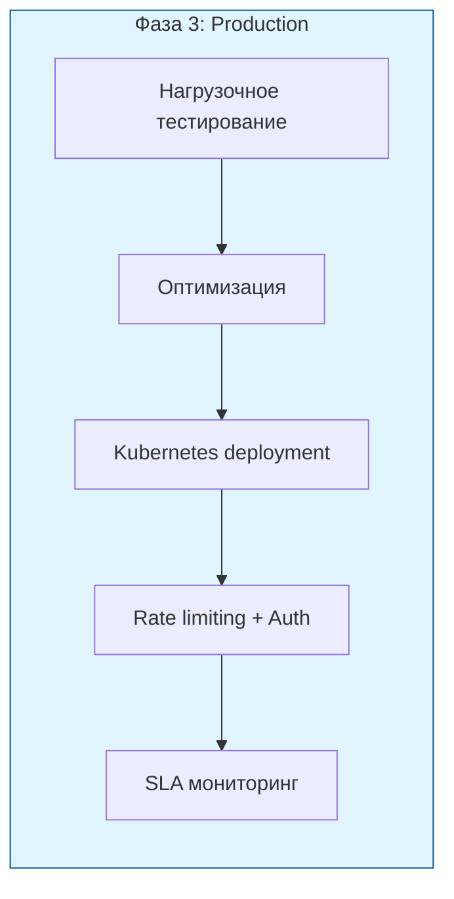
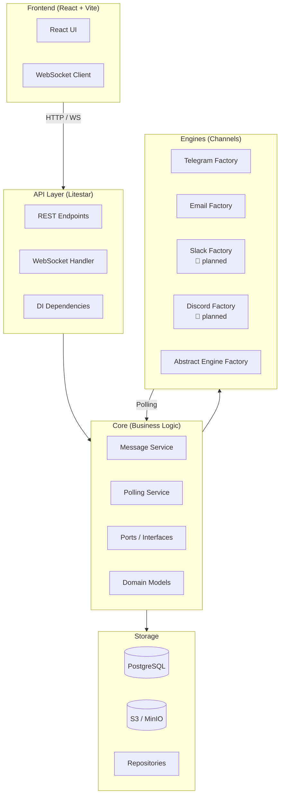
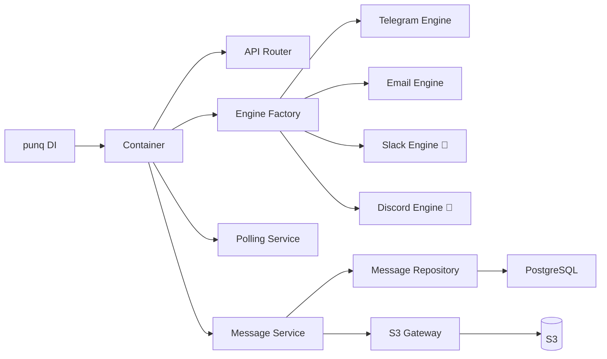

# Roadmap — Omnichannel Messaging Solution

> Фазы развития проекта PP-2026

---

## Фаза 1: Фундамент (MVP) ✅

| Компонент | Статус | Описание |
|-----------|--------|----------|
| Архитектура Hexagonal + Abstract Factory | ✅ | Порты/адаптеры, фабрика движков |
| DI-контейнер (punq) | ✅ | Внедрение зависимостей |
| PostgreSQL (SQLAlchemy + Alembic) | ✅ | Модели, миграции, репозиторий |
| Telegram Engine | ✅ | Чтение/отправка через бота |
| Email Engine (IMAP) | ✅ | Чтение/отправка через IMAP/SMTP |
| Litestar REST API + WebSocket | ✅ | Основные роуты, health-check |
| Frontend (React + Vite + Tailwind) | ✅ | Список сообщений, фильтр, ответ |
| S3 Gateway | ✅ | Хранение вложений |
| MkDocs | ✅ | Документация кода |

---

## Фаза 2: Расширение каналов 🚧

| Компонент | Статус | Описание |
|-----------|--------|----------|
| Slack Engine | 🚧 Планируется | Интеграция через Slack Bolt |
| Discord Engine | 🚧 Планируется | Интеграция через discord-py |
| WhatsApp / SMS | 📋 Идея | Twilio / провайдеры |
| Умное распределение (Routing) | 📋 Идея | automatic channel routing |
| Шаблоны ответов | 📋 Идея | Canned responses |
| Attachments UI | 🚧 В планах | Просмотр вложений в фронтенде |
| Push-уведомления | 📋 Идея | Web Push / Email |

---

## Фаза 3: Production Ready

| Компонент | Приоритет | Описание |
|-----------|-----------|----------|
| Auth / RBAC | Высокий | JWT, роли пользователей |
| Rate limiting | Высокий | Защита API |
| Нагрузочное тестирование | Средний | k6 / locust |
| Kubernetes | Средний | helm-чарты, автоскейлинг |
| Sentry / Grafana | Средний | Мониторинг ошибок и метрик |
| Internationalization | Низкий | i18n для UI |

---

## Архитектура проекта (текущая)

---

## Dependency Graph

---

## Легенда

- ✅ — Реализовано
- 🚧 — В процессе / планируется
- 📋 — В бэклоге
